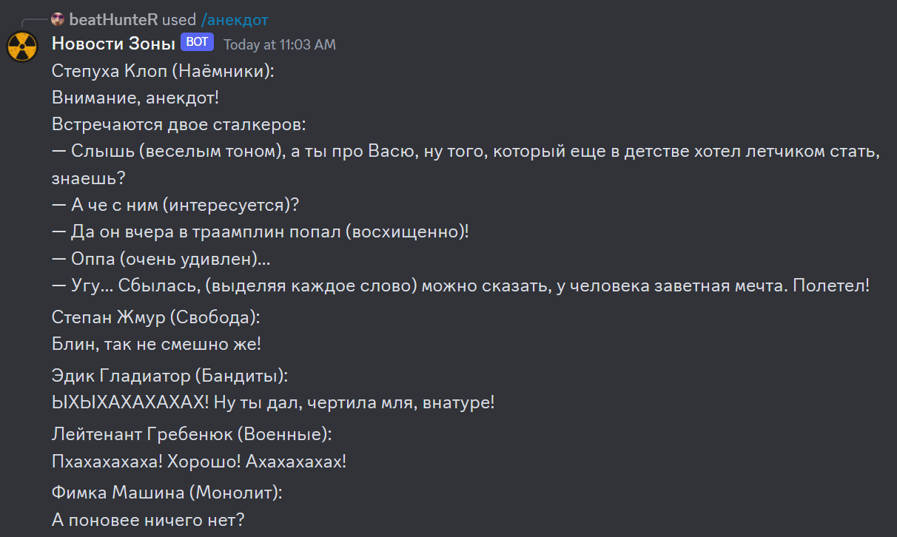

# Запуск через Docker

1. `git pull` ветку `zone_news_discord_bot_docker`
2. `docker build . -t bot` в корне запуленного репозитория
3. `docker run <image_name>`

После этого в терминале должно вылезти следующее

```bash
PS D:\Programming\Java\Idea Projects\ZoneNewsDiscordBot> docker image ls
REPOSITORY   TAG       IMAGE ID       CREATED          SIZE
bot          latest    b66d21f1dcea   38 minutes ago   755MB

PS D:\Programming\Java\Idea Projects\ZoneNewsDiscordBot> docker run b66
SLF4J: Failed to load class "org.slf4j.impl.StaticLoggerBinder".
SLF4J: Defaulting to no-operation (NOP) logger implementation
SLF4J: See http://www.slf4j.org/codes.html#StaticLoggerBinder for further details.
SLF4J: Failed to load class "org.slf4j.impl.StaticMDCBinder".
SLF4J: Defaulting to no-operation MDCAdapter implementation.
SLF4J: See http://www.slf4j.org/codes.html#no_static_mdc_binder for further details.
Exception in thread "main" javax.security.auth.login.LoginException: The provided token is invalid!
        at net.dv8tion.jda.internal.JDAImpl.verifyToken(JDAImpl.java:362)
        at net.dv8tion.jda.internal.JDAImpl.login(JDAImpl.java:279)
        at net.dv8tion.jda.internal.JDAImpl.login(JDAImpl.java:246)
        at net.dv8tion.jda.api.JDABuilder.build(JDABuilder.java:1918)
        at Main.main(Main.java:42)
```

Если при запуске у Вас выскочил такой же `LoginException`  - Вы все сделали правильно, так и должно быть.<br>

`LoginException` выскакивает из-за того, что `token`, который нужен для инициализации и запуска бота намеренно написан неправильно в `Dockerfile`. Это сделано потому, что этот token должен знать ТОЛЬКО разработчик бота.<br>

Если разработчик бота решит выложить этот token в интернет - Дискорд сразу же поймет это и насильно полностью изменит token. В результате чего token, только что выставленный в интернет, сразу же станет неактуальным.

___

___

# Discord-бот "Новости Зоны"

"Новости Зоны" - discord-бот, который предоставляет функционал модификации "Dynamic News" к игре S.T.A.L.K.E.R.

С этим ботом Вы можете:

- узнать текущие новости, которые в данный момент происходят в Зоне Отчуждения
- посмотреть сталкерские мемы
- почитать забавные (и не очень) сталкерские анекдоты
- попробовать рассказать анекдот и посмотреть, как на него отреагируют сталкеры

___

#### Список команд

`-новость` : новость <br>`-анекдот` : анекдот <br>`-мем` : мем <br>`-недавнее` : список последних 5 новостей <br>`-startnews` : включить ленту новостей в текущем канале <br>`-stopnews` : выключить ленту новостей в текущем канале <br>`-stopall` : выключить ленту новостей во всех каналах на сервере <br>`-chlist` : список всех каналов на сервере, на которых запущена лента новостей <br>`-botinfo` : информация о боте

___

#### Примеры работы бота

- Лента новостей<br>

- Мемы

  

- Анекдоты

  